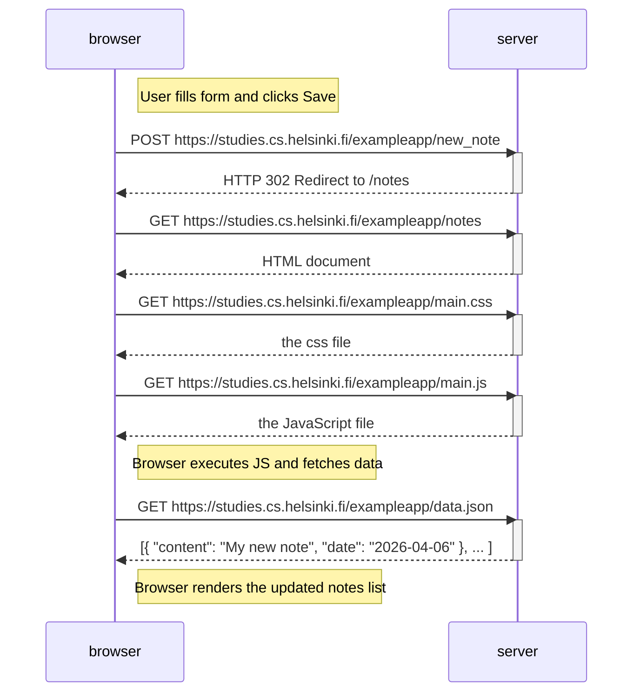
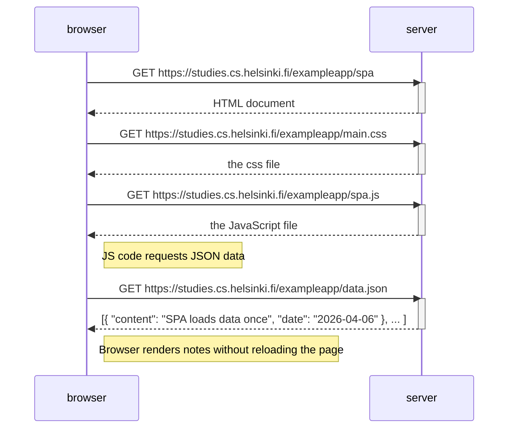
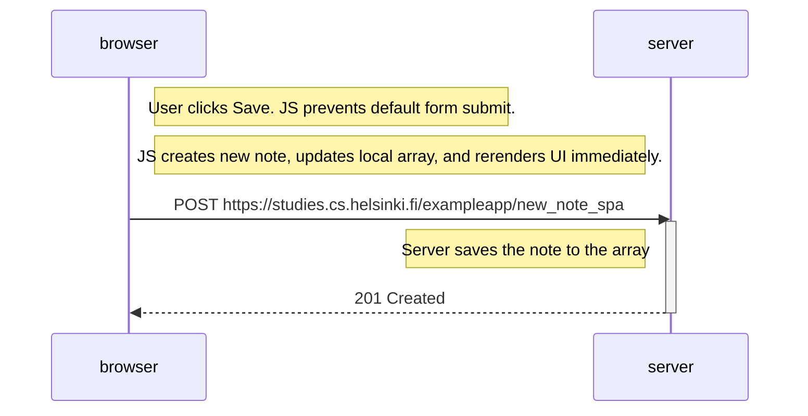

# Full Stack Open — Exercise Sequence Diagrams

## Exercise 0.4 — New Note (Traditional App)

```mermaid
sequenceDiagram
    participant browser
    participant server

    Note right of browser: User fills form and clicks Save
    browser->>server: POST https://studies.cs.helsinki.fi/exampleapp/new_note
    activate server
    server-->>browser: HTTP 302 Redirect to /notes
    deactivate server

    browser->>server: GET https://studies.cs.helsinki.fi/exampleapp/notes
    activate server
    server-->>browser: HTML document
    deactivate server

    browser->>server: GET https://studies.cs.helsinki.fi/exampleapp/main.css
    activate server
    server-->>browser: the css file
    deactivate server

    browser->>server: GET https://studies.cs.helsinki.fi/exampleapp/main.js
    activate server
    server-->>browser: the JavaScript file
    deactivate server

    Note right of browser: Browser executes JS and fetches data
    browser->>server: GET https://studies.cs.helsinki.fi/exampleapp/data.json
    activate server
    server-->>browser: [{ "content": "My new note", "date": "2026-04-06" }, ... ]
    deactivate server

    Note right of browser: Browser renders the updated notes list
```

---

## Exercise 0.5 — SPA Initial Load

```mermaid
sequenceDiagram
    participant browser
    participant server

    browser->>server: GET https://studies.cs.helsinki.fi/exampleapp/spa
    activate server
    server-->>browser: HTML document
    deactivate server

    browser->>server: GET https://studies.cs.helsinki.fi/exampleapp/main.css
    activate server
    server-->>browser: the css file
    deactivate server

    browser->>server: GET https://studies.cs.helsinki.fi/exampleapp/spa.js
    activate server
    server-->>browser: the JavaScript file
    deactivate server

    Note right of browser: JS code requests JSON data
    browser->>server: GET https://studies.cs.helsinki.fi/exampleapp/data.json
    activate server
    server-->>browser: [{ "content": "SPA loads data once", "date": "2026-04-06" }, ... ]
    deactivate server

    Note right of browser: Browser renders notes without reloading the page
```

---

## Exercise 0.6 — New Note (SPA)

```mermaid
sequenceDiagram
    participant browser
    participant server

    Note right of browser: User clicks Save. JS prevents default form submit.
    Note right of browser: JS creates new note, updates local array, and rerenders UI immediately.

    browser->>server: POST https://studies.cs.helsinki.fi/exampleapp/new_note_spa
    activate server
    Note left of server: Server saves the note to the array
    server-->>browser: 201 Created
    deactivate server
```
